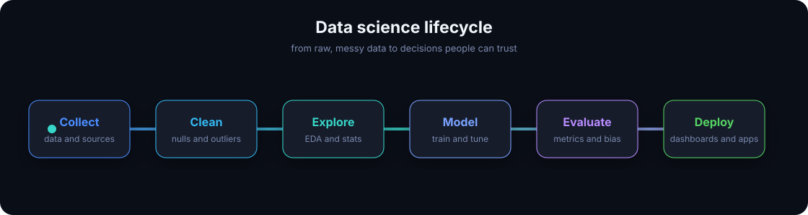

  

<h1 align="center">Lucas Shimaki Batistti</h1>

  <strong>Data Scientist (in training) · Machine Learning · Statistics · Analytics Engineering</strong> 
  Turning messy real-world data into models, dashboards and decisions.

  Blumenau, Santa Catarina, Brazil · Português / English

  <a href="https://github.com/shima2803">GitHub</a> ·
  <a href="https://www.linkedin.com/in/lucasshimazakibatistti/">LinkedIn</a> ·
  <a href="mailto:lucassbatistti@gmail.com">Email</a>

  
  
  
  
  
  
  
  

  

---

## About

I work at the intersection of **statistics, programming and business**. My focus is the full data pipeline: from **collection and cleaning**, through **exploratory analysis and statistical / predictive modeling**, to the **communication of insights** that actually drive decisions.

I'm a Computer Science student at **FURB** (Universidade Regional de Blumenau) and I care about the parts of the work that are easy to skip: data quality, honest validation, and dashboards that make a decision easier instead of just prettier.

  

---

## Featured Projects

| Project | What it does | Stack |
|---|---|---|
| [encontra-talentos](https://github.com/shima2803/encontra-talentos) | Full-stack recruitment portal with AI-driven resume analysis, external job aggregation and candidate-to-vacancy matching. | Next.js, TypeScript, FastAPI, PostgreSQL, Gemini |
| [Brazil-Stocks](https://github.com/shima2803/Brazil-Stocks) | Time-series analysis of Brazilian stocks (B3): price evolution, volume, volatility and financial KPIs. | Power BI, DAX, Python |
| [Brasil E-Commerce (Olist)](https://github.com/shima2803/Brasil-E-Commerce-2016-2018-) | EDA on Brazilian e-commerce (2016–2018): sales patterns, shipping behavior, satisfaction and cohorts. | Power BI, SQL, pandas |
| [AI_Student](https://github.com/shima2803/AI_Student) | Impact of AI on student routines — usage, perception and correlation with academic performance. | Power BI, statistics |
| [Eletric_Cars](https://github.com/shima2803/Eletric_Cars) | Evolution of electric vehicles in Brazil — sales, brands, distribution and charging infrastructure. | Power BI, pandas |
| [Laysoffs](https://github.com/shima2803/Laysoffs) | Global layoffs dashboard — companies, industries, regions and temporal trends. | Power BI, data cleaning |

> Also: [`WaatWorks`](https://github.com/shima2803/WaatWorks) (Java · Entra21 — energy-bill parsing).
> In development: an RPA pipeline `Power BI → PostgreSQL` (Selenium + psycopg2 + idempotent loads).

---

## Main Stack

**Languages**  
Python · SQL · R · Java · JavaScript · Bash

**Data & Analysis**  
pandas · NumPy · Polars · SciPy · statsmodels · EDA · feature engineering

**Machine & Deep Learning**  
scikit-learn · XGBoost · LightGBM · PyTorch · TensorFlow · Keras · Hugging Face

**Visualization & BI**  
Power BI · DAX · Matplotlib · Seaborn · Plotly · Streamlit

**Data Engineering & MLOps**  
PostgreSQL · MySQL · BigQuery · Airflow · dbt · Spark · MLflow · Docker · FastAPI

---

## Focus Areas

| Area | Topics |
|---|---|
| **Statistics** | Hypothesis & A/B testing · Bayesian inference · Causal inference |
| **Machine Learning** | Supervised / unsupervised · Tree-based models · Ensembles · Cross-validation |
| **Deep Learning** | Neural networks · CNNs · RNNs · Transformers (intro level) |
| **NLP** | Text preprocessing · Embeddings · LLMs · RAG applications |
| **Analytics Engineering** | ELT · Kimball modeling · Data quality · Lineage |
| **Business Intelligence** | KPI design · Storytelling · Dashboards that drive action |

---

## Currently

- Studying **Machine Learning, Deep Learning, statistical inference and causal inference**.
- Building [`encontra-talentos`](https://github.com/shima2803/encontra-talentos) — AI-based resume analysis with Gemini.
- Roadmap: **MLOps** (MLflow, DVC), **dbt**, **Apache Airflow**, **PySpark** and dimensional modeling.
- Completed the **Java Bootcamp @ Entra21** (2025).
- Ask me about: EDA, feature engineering, classical ML, SQL window functions, Power BI / DAX.

---

<strong>Resumo em português</strong>

 

Sou **Cientista de Dados em formação** em Blumenau (SC) e estudante de **Ciência da Computação na FURB**. Meu foco é o pipeline completo de dados: da **coleta e limpeza** à **análise estatística**, **modelagem preditiva** e **comunicação de insights** que viram decisão.

Trabalho na interseção entre **estatística, programação e negócio** — transformando dados bagunçados do mundo real em modelos, dashboards e histórias.

- Ciência da Computação @ **FURB**.
- Estudando: **Machine Learning, Deep Learning, inferência estatística e causal**.
- Bootcamp Java @ **Entra21** (2025) — concluído.
- Projeto ativo: [`encontra-talentos`](https://github.com/shima2803/encontra-talentos) — análise de currículo com IA (Gemini).
- Roadmap: **MLOps** (MLflow, DVC), **dbt**, **Airflow**, **PySpark** e modelagem dimensional.

**Foco:** análise exploratória, modelagem estatística e preditiva, engenharia de dados e dashboards que conectam operação técnica a estratégia de negócio.

---

  
  
  

  <em>Turning messy data into models, dashboards and decisions · transformando dados em decisão.</em>

